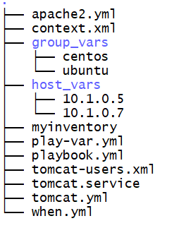

## Varibale
  1. removing odd coding on Playbook 
  2. rather than changing in multiple place just chnage in one place 

### Varibales places
  1. varibales use in playbook 
  2. refer playbook: var-in-playbook.ym 

## Defining variables at runtime
  1. in Playbook two variables 
  2. now in place of apache2 i want to install tree and httpd - htop 
  3. above values change in runtime using flags  -e or --extra-vars
  4. ```ansible-playbook var-in-playbook.yml -i myinventory --extra-vars "package_name=tree package_centos_name=htop"``` 
  5. command always win the precedence 

## Variabls in Inventory file 
1. Host Vars: defining variable in host level 
```
cat myinventory
10.1.0.5  package=git
10.1.0.7  package_rhel=tree
```  
2. group vars - defining variable in group level
```
cat myinventory
[ubuntu] 
10.1.0.5
[centos] 
10.1.0.7

[ubuntu:vars] 
package_name=git
[centos:vars]
package_rhel=tree 

``` 
1. Note: Precendence In Inventory host vars and inventory group vars = always wins hostvars 

## hostvars: 
   1. just create folder with host_vars and inside create file with Hostname(ipaddress or fqdn) 
   2. ```mkdir host_vars``` and create file ```touch 10.1.0.5``` 
   3. create varaible in side file 
   4. and define in playbook using jinja format

## groupvars: 
  1. just create folder name with group_vars and inside create file name with gropname eg ubuntu and centos 
  2. ```mkdir group_vars``` and create file ```touch ubuntu``` and ```touch centos```
  3. create varaible in side file 
  4. and define in playbook using jinja format 
  5. Please refer below Image
    


