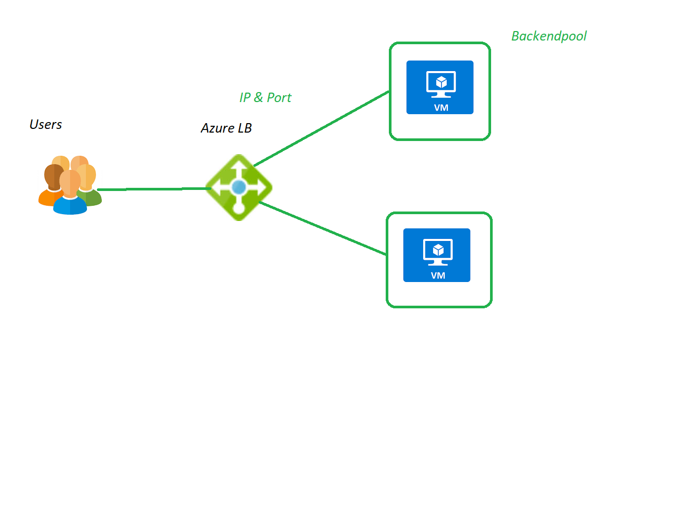

## Azure Load Balancer: 
   1. Users instead of directly going onto Machine, they will hitting Azure Load balancer.
   2. its working on Layer - 4.
   3. OSI MODEL [osi model](https://www.geeksforgeeks.org/layers-of-osi-model/)
   4. its looks at just IP address and Port number, then distribute the traffic 
## Application gateway: 
   1. its not simple routing meachnism like Azurelb.
   2. its Layer-7, its managing the web traffic.
   3. its have WAF(Web Application Firewall) its protect from common threats for web application.
   4. WAF based on CRS (Core Rules Set) using OWASP(Open Webapplication Security project), its working common threats for Web Application 
   5. WAF have 2 modes 
       1. Prevention Mode: if The Rules is match, then Prevent the access
       2. Detecction Mode: if The Rule is Match it detect and store in Logs, its not prevent access.
   