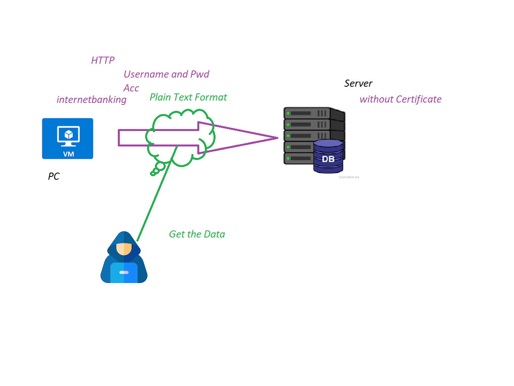
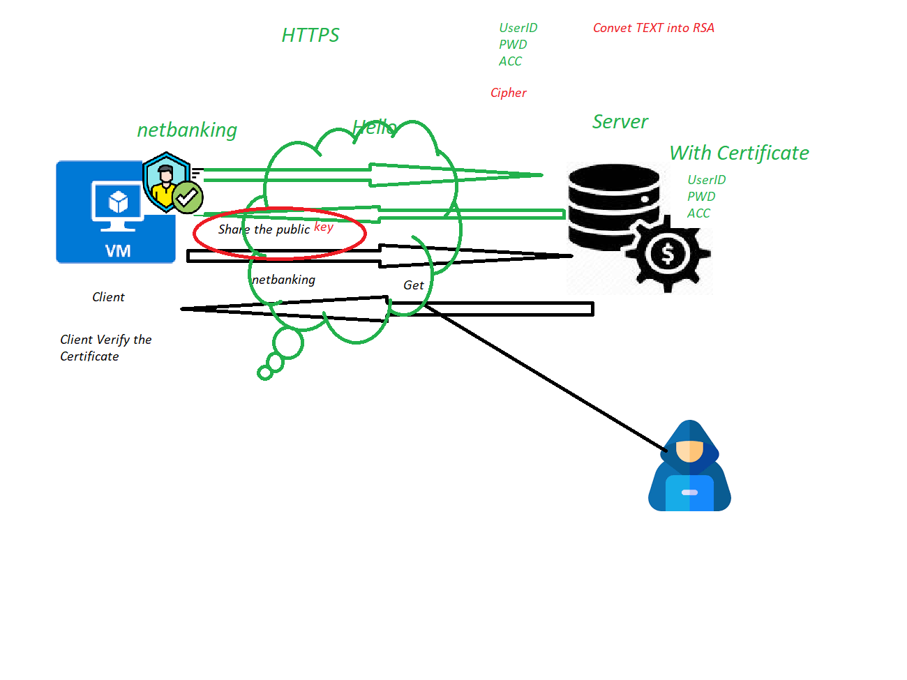
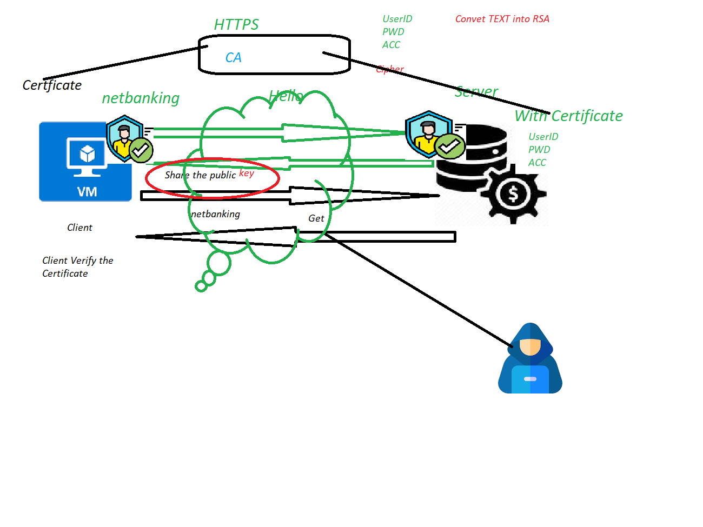

## HTTP: Hyper Text Tranfer Protocal 
   1. its not secure 
   2. the data sent in plain text over Internet 
   3. chances high to Hack the data. 
   4. Port: 80
## HTTPS:  SSL/TLS 1.3 
   1. Its Secure connection.
   2. the data sent in RSA code over Internet.
   3. data compltely encrypted via internet. 
   4. Port: 443

## MTLS: its extension of TLS  
  1. Clinet and Server have certificate.
  2. Both Side authentication using Public/Private key.
  3. Traffic Secure and trusted in both Direction. 
  4. port: 443