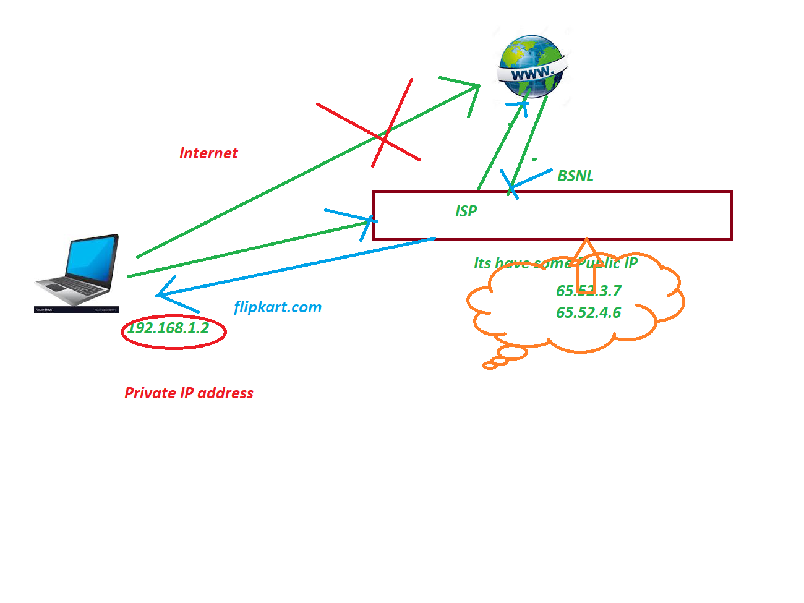
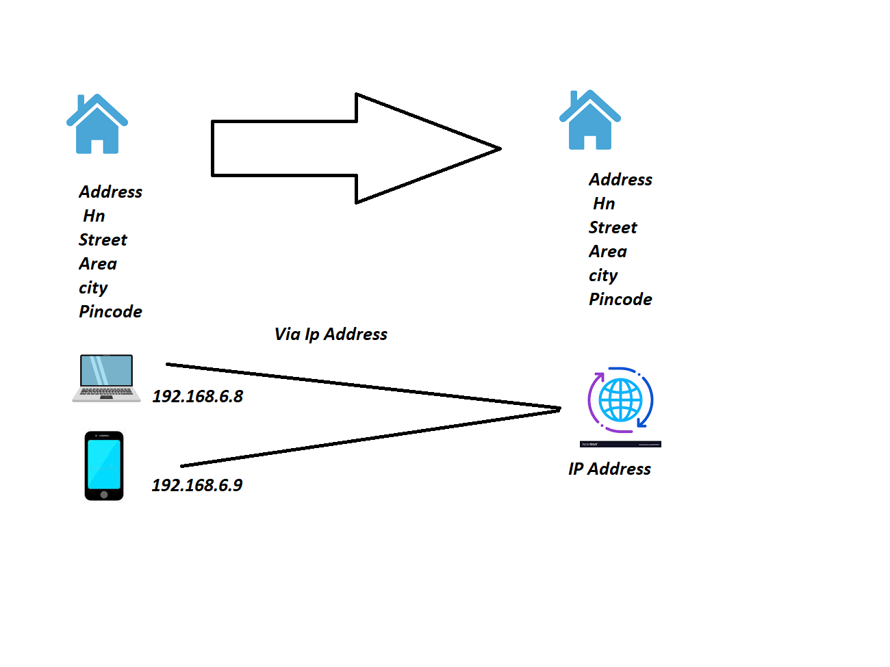
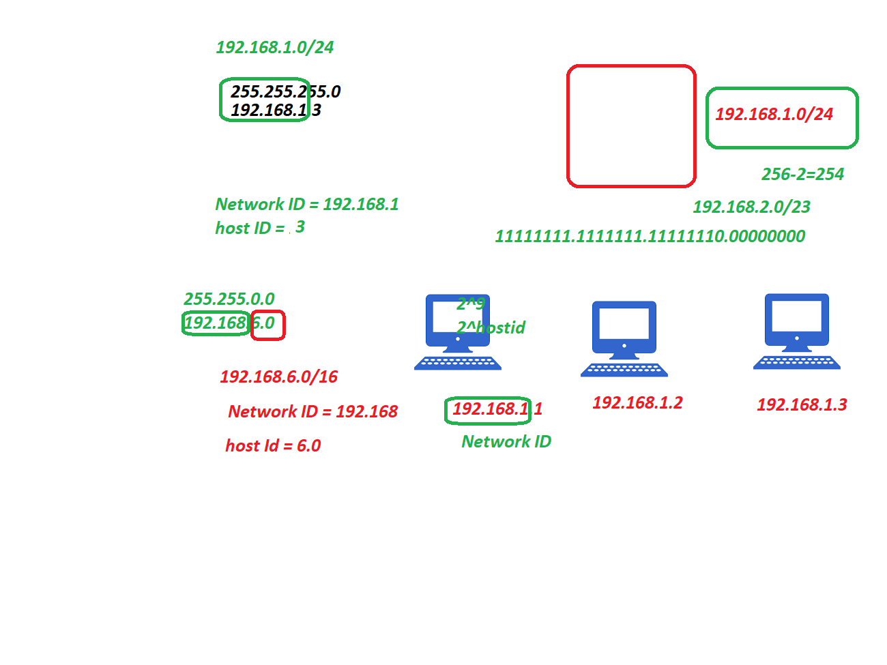

## IP Address 
   1. IP Internet Protocal 
   2. How to access Internernet via IP Address 
   3. Types of IP Address 
        1. Public: We can Access any where
            1. Static 
                1. this IP address Never change
            2. Dynamic 
                2. this IP address will change when you restart Machine
        2. Private Address: We can Access only within the network
            1. reserved Private Ip Ranges 
                1. 192.168.x.x/x ---> <65k you can connect upto 65k devices
                2. 172.16.x.x/x to 172.32.x.x/x ---> >65k you can connect more than 65k devices
                3. 10.x.x.x/x ---> you can connect up 4.5 crores 
          

### How to access Internet 
   1. we access internet only with Public IP, We can't access with private 
   2. But we still access internet with Private IP Address using ISP ie BSNL, Hathway, Act fiber, Airtel Vodafone 

### Types of IP Version 
   1. Ipv4
      1. this IP address consists of 4 bytes and 32 bits 
      2. we can connect up 2^32 devices 
      3. eg: 192.168.5.6 
      4. Computer can not understand decimal and hexadecimal 
      5. so its convert into Binary format 
      6. IPV4 means 4 bits each bit separate by dot(.), 1bit == 8 bytes, each byte represents 0 or 1
      7. what is the Maximum values of bit --> 255 convert binary 11111111 
      8. what is the minimum value of bit ---> 0 convert into binary 00000000 
      9. subnet mask --> 255.255.255.0 ~> 1111111.1111111.111111.0000000 

   2. Ipv6: 
      1. this the big range, if you want to connect more than 4.5 cr device then you need to use IPV6 
      2. 2^128  

### CIDR
   1. Class full network 
      1. 192.168.0.0/24 
         ```
         192.168.0.0/24
         total number bits = 32
         subnet mask = 24 
         Host Ip's = total number of bits - subnet mask 
         host ip's = 32-24 = 8 
         host ip's = 2^8 = 256 - 5 = 251 
         255.255.255.0
         11111111.1111111.1111111.00000000
         ```

      2. 192.168.0.0/16 
         ```
         192.168.0.0/16 
         total number of bits 32
         subnet mask = 16 
         Host address = 32-16 = 16 
         255.255.0.0 
         11111111.1111111.0000000.0000000

         2^host address = 2^16 = 65k 
         by using this network you can connect up 65K

         ```
      3. 10.0.0.0/8  --> 4.5 cr IPs
   2. I want create Network with 1000 ip(my n/w needs to be 1000 devices) 

   ### Class less Network 
     1. We can network based your requiremenmt - you will approximatly met the requirement  
        ``` 
        11111111.11111111.1111111.00000000 = 256 
        11111111.11111111.1111110.00000000 = 512 
        11111111.11111111.1111100.00000000 = 2^host address 2^10 = 1024
        255.255.251.0 
        subnet mask = /22 
        192.168.0.0/22 
        ``` 
     2. 5k Ips
     ```
        11111111.11111111.11111100.00000000 = 1024 
        11111111.11111111.11111000.00000000 = 2048 
        11111111.11111111.11110000.00000000 = 4096 
        11111111.11111111.11100000.00000000 = 8192
        11111111.11111111.11000000.00000000 = 16384  
        255.255.224.0 
        /19 
        192.168.0.0/19 
        11111111.11111111.11000000.00000000 = 16384 
        255.255.192.0 = netmask 
        18 subnet mask 
        192.168.0.0/18  
        IP Address = Network ID + Host ID  

        the fist IP 192.168.12.0 - 192.168.12.255  


        10.3.6.8 
        255.0.0.0

        Network ID = 10
        Host ID = 3.6.8 

        192.168.7.9
        255.255.0.0 

        192.168.0.0/16

        Network ID = 192.168
         Host ID = 7.9 
       ``` 
       


