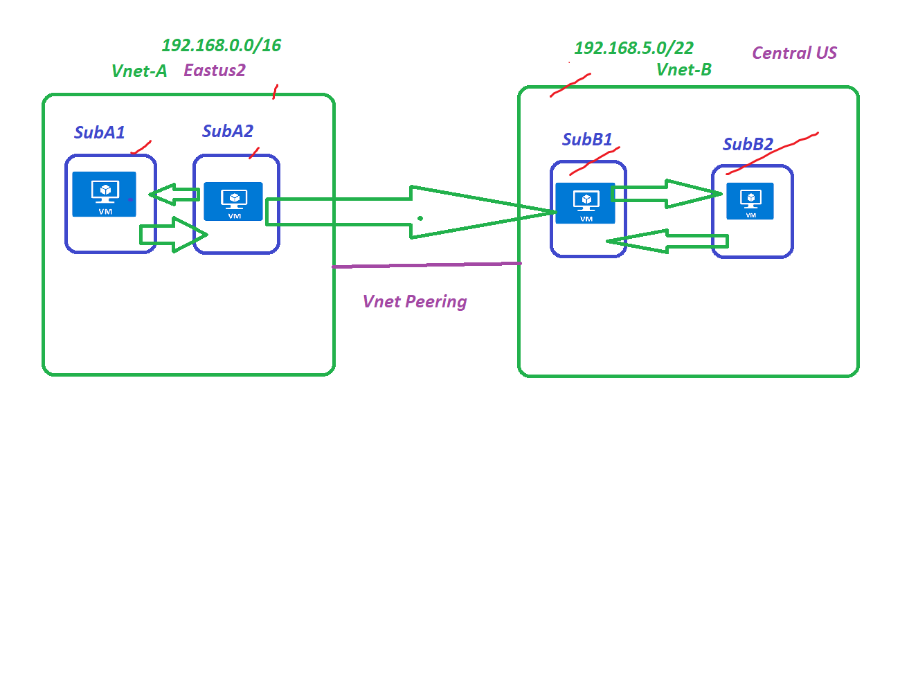

### Vnet Peering 
  1. Connecting devices across Vnet's using Vnet Peering 
  1. Lab Setup 
      1. Create Vnets VnetA and VnetB 
      2. Create 2 subnets in each Vnet
          1. SubA1 And SubA2 under VnetA
          2. SubB1 and SubB2 under VnetB 
      3. Deploy Vm's on each Subnets without Public 
  