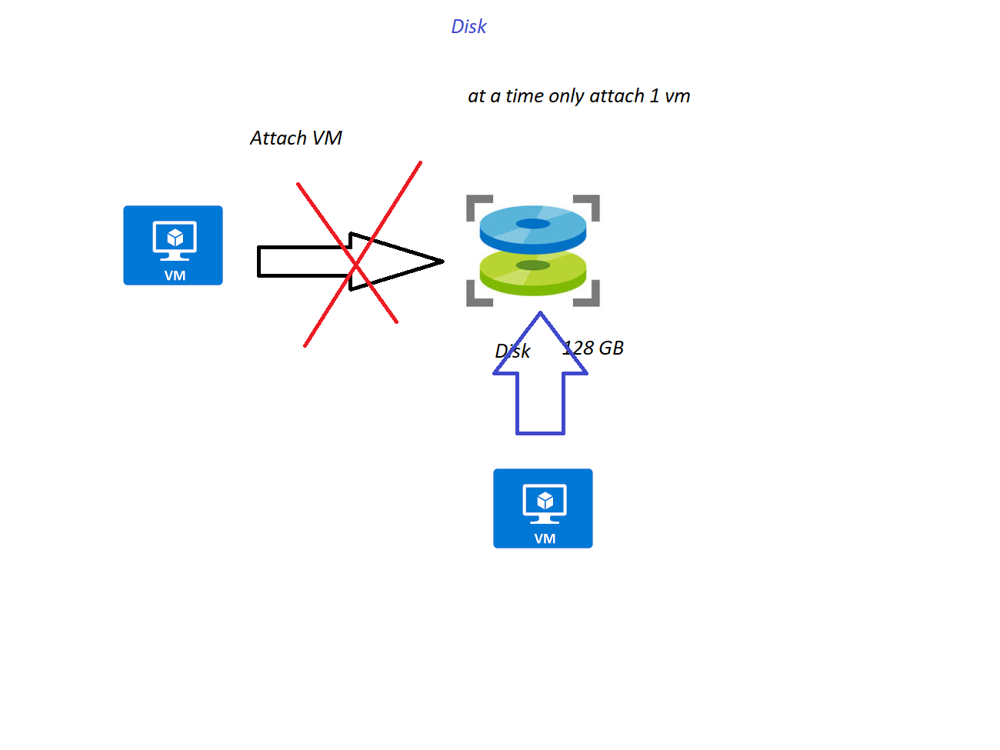
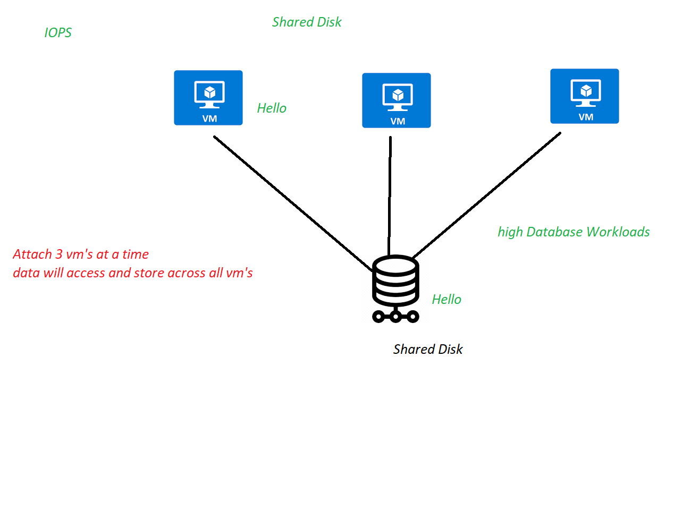

## Managed Disk 
  1. Its Completelty managed by Azure
  2. Its Support High Availability  

## its additional HDD Disk 
  1. create and attch managed disk to the VM
  2. Mount to The Virtual machine 
### Disk Types 
  1. HDD Managed Disk 
      1. Cheap and slow 
      2. 32,767 GB of Storage  
      3. HDD Type Disk generally we use in Backup Environmemnt, non critical Applications
      4. IOPS: 2000
      5. Throughtput: 500
  2. Standard SSD 
      1. Faster and Avg IOPS and Throughtput 
      2. 32,767 GB of Storage
      3. IOPS: 6000
      4. Throughtput: 750 MB/s
  3. Premium SSD
      1. Much faster than Standard SSD
      2. Use case: Production Environment and business critical Application
      3. 32, 767 GB of Storage 
      4. IOPS: 20000 
      5. Throughtput: 900 MB/s 
   4. Ultra Disk 
      1. used for High IO intensive Workloads such as SAP HANA , Oracle, Sql database 
      2. it have high IOPS and Throughput 
      3. High Speed performance 

### SnapShot: 
   1. Backup of Disk 
   2. You can restore the DataDisk using Sanpshot 

### Sever Side Encryption: SSE 
   1. PMK-Platform Managed Key: the keys managed by platform 
   2. CMK-Customer Manged Key: the keys Securely managed Us
        1. KeyVault -> Its a PAAS , its for Securely Storing the Keys, Certificates,Credentials
        2. Disk Encryption Set: Privatekey and Publickey 
   3. ADE  
[Server Side Encryption](https://docs.microsoft.com/en-us/azure/virtual-machines/disk-encryption) 

### Shared Disk: 
 1. Disk: We can Attach one VM at a time 
 2. Azure File Share ---> Network Drive 
 3. Shared Disk: 
     1. You can attach multiple VM's at a time 
     2. [Shared Disk](https://docs.microsoft.com/en-us/azure/virtual-machines/disks-shared)

### Manged vs Unmanaged Disk 
   1. Maintain: 
     1. Managed disk by default store storage account , its Maintained by Azure platform
     2. Un Managed disk maintain by user 
         1. create storage Account first 
         2. then create Unmanaged Disk 
   2. Price: 
      1.  Managed Disk eg: I created Disk with 1024 GB, but I am using only 10 gb  --> need to pay for complete disk size  
      2.  Un Managed Disk you need pay for how much you use
  