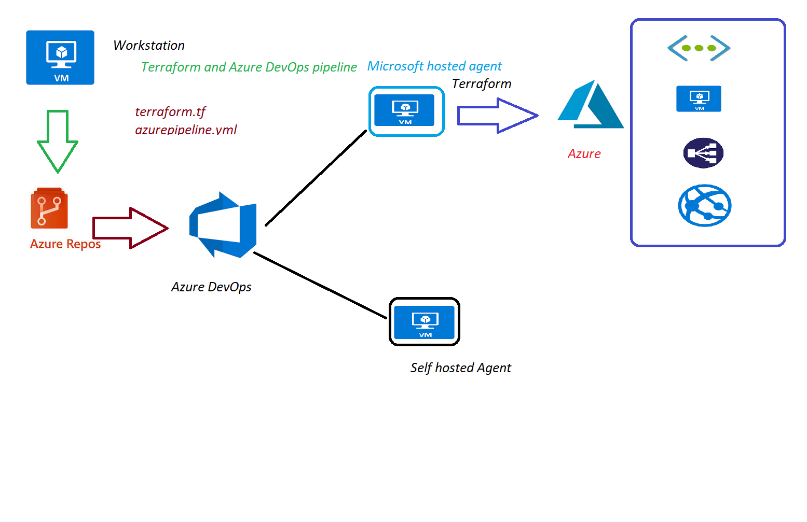

## Azure DevOps with Terraform 
  1. Create Organization 
  2. create Project with Git and Basic 
  3. create Azure repo 
  4. push terraform files to repo 
  5. install terraform extension on Azure DevOps [terraform Extension](https://marketplace.visualstudio.com/items?itemName=charleszipp.azure-pipelines-tasks-terraform) 
  6. develop pipeline  
      
  7. Impotant Terms 
      1. Stage 
      2. Job
      3. Steps
      4. Tasks/Scripts 