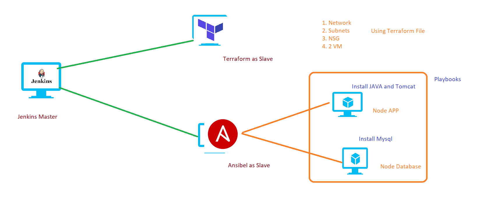

## CICD Stages 
### CI Stages: 
  1. clone Open-MRS code from github. `git clone https://github.com/openmrs/openmrs-core.git`
  2. build code using MAVEN `cd openmrs-core` and `mvn package`
  3. Code Quality Analysic - SONARQUBE 
  4. Storing Artifact -- NEXUS --> You can skip if you don't know [if you store artifact in Nexus it will give url for war file]. 
### CD Stages: 
  1. Deploy Application into Application[tomcat] 

## Configuration: Before Deployment 
### Infrastracture: 
  1. AWS or Azure or GCP or Private Cloud. ---> Terraform or AWS(CloudFormation) or Azure(ARM). 
  2. Configuraion and Setup: 
      1. Using Ansible or Shell Script setup enviornment. 
           1. Install JAVA ---> write Java ansible role OR You can take from Ansible galaxy(geerlinguy)
           2. Install Tomcat
           3. Install Mysql Database 
           4. Connection String. 
           5. Deployment Application.  