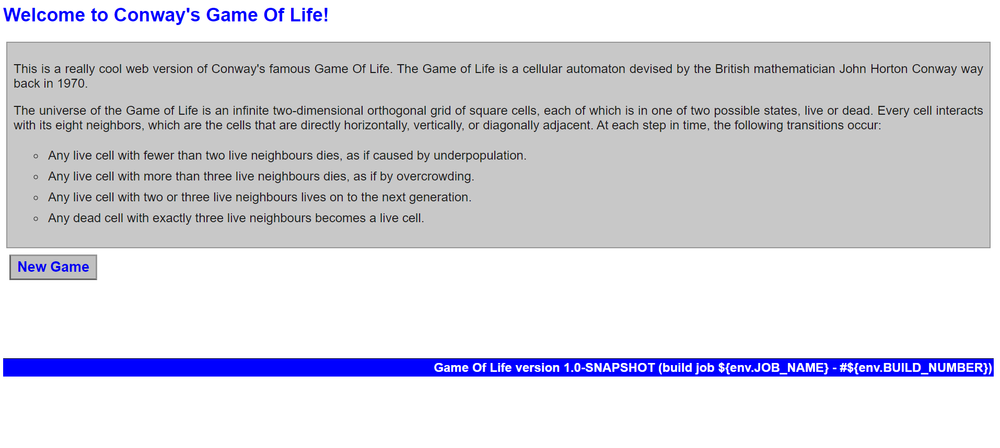

## Topics
   1. Monolithic and Micro Service
   2. basic requirements to run application 
       1. Developer develop code for Application 
       2. we need to convert code into Package --> developer develop Gpay mobile app coding --> Package  
       3. Deploy application into platform(Server) eg Windows, Linux  

### Java Application
   1. Developer develop java code for Banking Application 
   2. Code need to covert into Package(.jar , .war and .ear)  .exe for .net code 
      1. How Code convert into Package?  --> Build tool 
   3. Deploy into Platform 
        1. if you want to deploy Java application? where we deploy?
            1. You can deploy any OS (Linux or Windows, Mac)
            2. You need to deploy in Specific Application Server (Middileware)
                1. tomcat 
                2. weblogic 
                3. Wildfly 
                4. jetty  

### Deploy JAVA Application in Tomcat 
   1. java Sample project code [Click Here for Sample Code](https://github.com/wakaleo/game-of-life) 
   2. Clone Source Code ```git clone https://github.com/wakaleo/game-of-life.git``` 
   3. Install Apache Maven on ubuntu18
      ```
       sudo apt-get update
       sudo apt install openjdk-8-jdk -y
       sudo apt-get install maven -y
      ```

   4. Convert into Package(Build) by using Build tool --> eg Apache Maven it generate .war file 
      ```
      cd game-of-life 
      maven package
      ```
   5. Install Tomcat8 on ubuntu 18 ```sudo apt-get install tomcat8 -y```
   6. Deploy .war file into Tomcat8 into specific location ```cd /var/lib/tomcat8/webapps``` 
   7. how to access application? --> http://publicIP:8080/gameoflife 
      
      
    