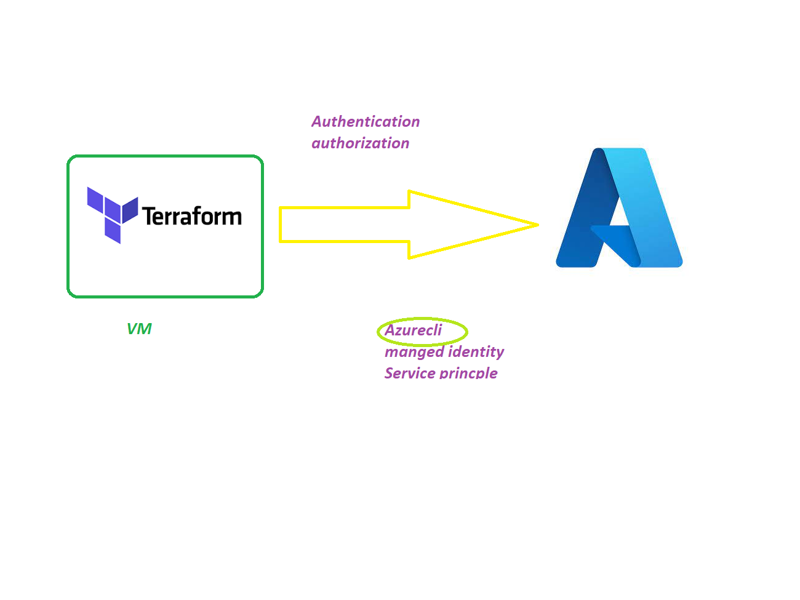

## Infrastructure 
   1. We need basic requirements to run an application, that basic needs call it as Infrastructure 
   2. Create VM 
       1. Hardware
       2. Software
       3. Network
### How to create resources in Azure 
  1. Azure Portal --> Manual way of setup infrastructure   
      1. Time Taken process
      2. Issue with Steps
  2. Azure CLI(command lines) 
  3. Terraform   ---> Infrastructure as a code, Building and Manage infrastructure by using code  
     1. write once and use many 
     2. no need docs
     3. create infra within minitus without issues 
     4. easy to build and manage infrastructure 
  4. SDK 

  ## IAC Tools 
     1. ARM Template --> its supports Azure(provider) 
     2. CLoud Formation -->its supports  AWS(Provider)
     3. Terraform --> generic, Public and Private clouds  , Its support 1000's provierds 

### How to create Infrastructure using IAC 
   1. LAB Setup  
      1. Azure CLI 
      2. Install terraform 
      3. VS Code 
      4. Install Azure terraform Plugin in VS Code
      5. Git 
   2. How we build infra using Code --> Building Blocks 
     1. provider(azure)
     2. resources 
     3. Variables
         1. Input variables
         2. Out Values
         3. Locals 
     4. provisioners
          1. file provisioner
          2. remote exec
          3. local exec
          4. chef and Puppet 

#### Points 
   1. How to create and manage Infra 
      1. Manual --> Azure portal 
      2. IAC  --> Terraform  
         1. Using Code we can build and manage the infrastructure 
         2. write once and use many

 

   
  